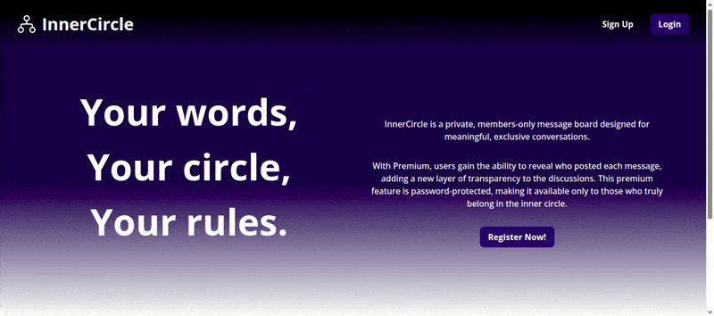

# Members Only - InnerCircle

## Summary

A message board application that requires user authentication to access messages. Members are assigned different status levels, and administrators have message deletion privileges. Built with Passport for authentication.

## Preview



## Features

- Secure user authentication with Passport
- Session-based user management
- Professional, modern styling
- Premium member features:
  - View message authors and timestamps
  - Access exclusive content
- Dynamic navigation based on user status
- Administrative controls for message management

## Technical Challenges Overcome

- Implementing Passport authentication
- Managing user sessions across the application
- Handling authentication error states
- Deploying to Railway (Platform as a Service)
- Complex EJS template conditionals

## Key Learnings

- Passport middleware implementation and configuration
- Integration of express-validator for error handling
- User middleware for request context
- Railway platform deployment and PostgreSQL setup
- Modular EJS templating with partials

## Technologies Used

- **Frontend:** HTML, CSS, JavaScript, EJS templating
- **Backend:** Node.js, Express.js
- **Database:** PostgreSQL with pg driver
- **Authentication:** Passport.js
- **Validation:** express-validator
- **Utilities:** serve-favicon, dotenv
- **Deployment:** Railway

## Installation & Setup

1. **Clone the repository:**

   ```bash
   git clone https://github.com/SReddy-96/TOP-members-only.git
   ```

2. **Navigate to project directory:**

   ```bash
   cd TOP-members-only
   ```

3. **Install dependencies:**

   ```bash
   npm install
   ```

4. **Configure environment variables:**

   - Create a `.env` file in the root directory
   - Required variables:

     ```.env
     DATABASE_URL=your_postgresql_connection_string
     SESSION_SECRET=your_session_secret
     PORT=3000
     ```

5. **Start the development server:**

   ```bash
   npm run dev
   ```

6. **Access the application:**
   Open your browser and navigate to `http://localhost:3000`

## Application Structure

### Pages

- **Home**: Message board (redacted content for non-premium members)
- **Sign Up**: New user registration
- **Login**: User authentication
- **Join Club**: Premium membership upgrade
- **New Message**: Create messages (authenticated users only)

### User Roles

- **Basic User**: Can view messages without author details
- **Premium Member**: Can view full message details including authors
- **Admin**: Additional message deletion privileges

## About

InnerCircle is a private, members-only message board designed for meaningful, exclusive conversations. Users can share messages while maintaining discretion—only Premium Members can see message authors and timestamps.

The platform offers a secure space for trusted exchanges, with features unlocked through premium access. Whether sharing ideas, asking questions, or offering insights, InnerCircle provides a protected environment for community interaction.
